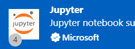
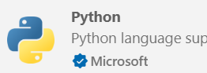

# AI Security Labs

Welcome to the AI Security Labs repository. This repository contains a series of labs designed to help students understand and apply various concepts in AI security.

## Introduction

In these labs, you will explore different aspects of AI security, including threat modeling, secure development practices, and more. Each lab is designed to provide hands-on experience with real-world scenarios.

## License

This project is licensed under the MIT License. See the [LICENSE](LICENSE) file for details.

# Setup
Follow these steps to set up your environment for the AI Security Labs.  Please note the versions required for the labs.  If you have a different version of Python installed, the labs may not work correctly.

## Step 1: Install Python
If you don't have Python installed, you can download and install it from the official website.
- [Python 3.10.0](https://www.python.org/downloads/release/python-3100/)

> **Note - the labs require version 3.10.0.  If you have installed a different version, the labs will not work correctly.** Make a note of the installation directory.  You will need this information later.

## Step 2: Install Visual Studio Code
Visual Studio Code is a lightweight but powerful source code editor which runs on your desktop and is available for Windows, macOS and Linux. It comes with built-in support for JavaScript, TypeScript and Node.js and has a rich ecosystem of extensions for other languages (such as C++, C#, Python, PHP, Go) and runtimes (such as .NET and Unity).
- [Visual Studio Code](https://code.visualstudio.com/)
- Don't install Visual Studio (community, professional, or enterprise) - it is a different product.

## Step 3: Download the StudentWork folder
- Download the *StudentWork.zip* file and unzip it into an empty folder.
- Open Visual Studio Code 
- Choose *File/Open Folder...* and open **Labs** in unzipped *StudentWork* folder. 

## Step 4: Install Extensions 
- VS Code will probably ask to install several extensions.
- Click the *Install* button to install the recommended extensions.

If VSCode did not offer to install the extensions, click the Extensions icon  on the left side of the window.  Search for the following extensions and install them.

| Extension | Icon |
|--------------------------|--------------------------|
|Jupyter  (Microsoft) |  |
|Python (Microsoft) |  |
|Python Debugger (Microsoft) |  |
|Pylance (Microsoft) |  |

## Step 5: Open the setup notebook
- Expand *00-Setup* from the *Explorer* pane on the left.
- Open the *[00-Setup.ipynb](00-Setup/00-Setup.ipynb)* notebook.
- Follow the instructions in the notebook to complete the setup.